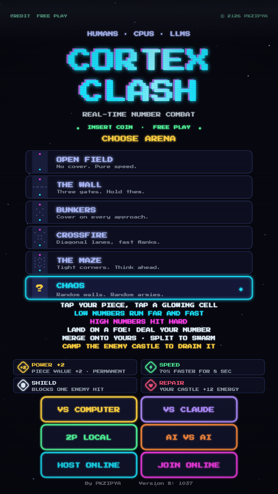

# Cortex Clash

Retro real-time strategy duel built as a single HTML5 canvas game. Numbered
pieces battle across a 9×13 grid: low numbers run far and fast, high numbers
hit hard. Drain the enemy castle — or wipe out their army — to win. No turns;
both sides act at once.

Play a human across the table, a tunable CPU, or a frontier LLM — on one phone
or online. Wrapped in an 80s arcade-cabinet look: neon CRT scanlines, a chiptune
soundtrack, and an attract-mode title screen.

**▶ Play now: https://pkolarov.github.io/cortexclash/**

## Play

- **`index.html`** — the full game. Serve the folder with any static server, or
  enable GitHub Pages on this repo and play at your Pages URL. Phone-first.
- **Install as an app (PWA):** open the Pages URL in Android Chrome → menu →
  **"Install app"** (or "Add to Home screen"). Runs fullscreen with its own icon
  and works offline after the first load. iOS: Safari → Share → "Add to Home
  Screen". Requires HTTPS — GitHub Pages provides this automatically.
- **`cortex-clash-standalone.html`** — single self-contained file, works offline
  (online multiplayer still needs internet for matchmaking).

## Modes

- **Vs Computer** — a heuristic bot across five tiers, EASY → NORMAL → HARD →
  VERY HARD → INHUMAN. Higher tiers hunt your pieces, dodge bad trades, mass
  spearheads, and punish a turtle (see **Opponent AI** below).
- **Vs Claude / GPT / Gemini** — hand the wheel to a real LLM (Claude
  Opus/Sonnet/Haiku, GPT-5.5 / GPT-5.4 mini, or Gemini 3.5 Flash). It's fed the
  board state each turn and replies with moves + a retro taunt. Bring your own
  API key; it's stored only on your device, and the match falls back to the CPU
  if the key is missing or the model errors out.
- **Local battle** — two players share one phone, face to face; the top player's
  pieces and HUD are rotated toward them.
- **AI vs AI** — pick any two opponents (CPUs or LLMs) and watch them fight.
- **Online battle** — host creates a room (4-letter code / invite link with
  `#room=CODE`), guest joins. WebRTC peer-to-peer via the public PeerJS broker;
  host runs the authoritative simulation and streams state at ~15 Hz.

## Rules

- Tap your piece, tap a highlighted cell. No turns — both players act in real time.
- A piece moves `7 − value` cells per hop and deals its value in damage. Land on
  an enemy and you only survive if your value ≥ theirs (a clean kill); otherwise
  your piece is the one that dies.
- Land on your own piece to merge (max 6); use SPLIT to peel off a fragment.
- Any piece parked on a castle drains it at `0.7 × value`/sec — including your
  own defenders, so save your castle and then move off.
- Power-ups spawn mid-field: **+2** permanent value, **bolt** 70% speed for 8 s,
  **shield** blocks one hit, **heart** +12 castle energy.
- Win by draining the enemy castle to 0 **or** eliminating all their pieces.
- Arenas: five fixed layouts plus **CHAOS** (random mirrored walls and armies).

## Opponent AI

The local bot is a pure heuristic — it scores every legal move and picks the
best — but the top tiers play a real positional game rather than rushing the
castle:

- **Hunting** — chases enemy pieces it can profitably kill (its value ≥ theirs),
  favouring big, nearby quarry.
- **Danger sense** — won't park where an enemy can kill it for free next turn,
  so it's hard to farm with favourable trades.
- **Spearheads** — merges pieces into a heavy unit specifically when that forges
  a piece able to out-muscle your strongest defender.
- **Anti-turtle squeeze** — if you hunker down on your castle, it dominates the
  mid-field power-ups to snowball and marches an (effectively unkillable)
  battering ram at you: come out and contest, or get ground down.

Difficulty scales these behaviours (plus reaction time and moves-per-turn), so
EASY stays beatable and human while INHUMAN is relentless.

## Sound

WebAudio throughout — no audio files. Chunky chiptune SFX for every action and
an 80s synthwave loop on the menus (triangle bass, square arp + lead, noise/sine
drums), scheduled on the audio clock so it stays locked. Tap the speaker icon to
mute. Audio starts on your first tap (browser autoplay policy).

## Code layout

| File | Role |
| --- | --- |
| `game/engine.js` | Rules + real-time simulation (no rendering) |
| `game/render.js` | Canvas renderer: board, tokens, HUD, arcade title/lobby/join screens |
| `game/ai.js` | Opponent AI: heuristic bot (difficulty tiers) + LLM controllers |
| `game/net.js` | WebRTC online play (PeerJS), state sync, host-authoritative |
| `game/main.js` | Input, screen routing, main loop |
| `game/boards.js` | Arena definitions |
| `game/sound.js` | WebAudio chiptune SFX + menu music |
| `manifest.webmanifest` + `sw.js` + `icons/` | PWA: install-to-home-screen + offline cache |
| `tools/build.py` | Bumps the cache version + rebuilds the standalone bundle |

## Build / CI

Just edit `game/*.js` and push — **don't bump the version by hand**. A GitHub
Actions workflow ([.github/workflows/build.yml](.github/workflows/build.yml))
runs `tools/build.py` on every push that touches game code, which:

1. bumps the cache-busting version (the `?v=NN` query strings in `index.html`
   and the `cortex-clash-vNN` `CACHE` name in `sw.js`) so the service worker and
   installed PWAs pick up the change, and
2. regenerates the single-file `cortex-clash-standalone.html` bundle from current
   source,

then commits the result back (tagged `[skip ci]`). To run it locally:
`python3 tools/build.py`.

## License

Licensed under the [Apache License, Version 2.0](LICENSE).
